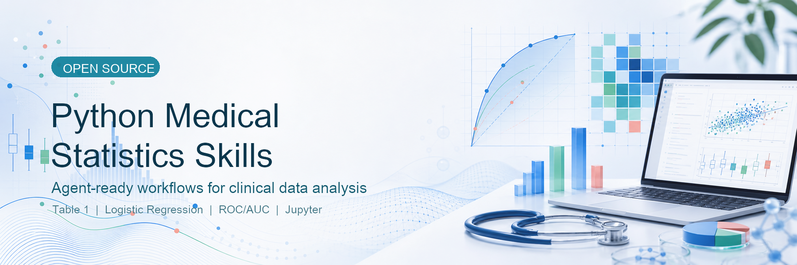

# Python Medical Statistics Skills



[中文](README.md)

Python Medical Statistics Skills is a collection of AI coding agent skills for medical statistics and Python data analysis. The project uses a generic `SKILL.md` structure, so it can be used by Codex and by other coding agents that support skill directories.

## Project Identity

This project provides medical research oriented statistical method guidance, Python analysis workflows, script templates, and Jupyter notebook workflows. It is designed to help agents support data checks, statistical modeling, result tables, visualization, and reproducible analysis.

The recommended Python stack includes:

- `pandas`
- `numpy`
- `scipy`
- `statsmodels`
- `scikit-learn`
- `lifelines`
- `matplotlib`
- `seaborn`

## Contents

- `basic-stats`: Basic statistical method skills, including t-tests, chi-square tests, ANOVA, correlation analysis, nonparametric tests, ROC, and sample size estimation.
- `advanced-stats`: Advanced statistical method skills, including logistic regression, multivariable regression, survival analysis, and PCA.
- `literature-stats`: Literature and study-design oriented skills, including propensity score matching and subgroup analysis.
- `python-script`: Plain Python script workflow for reproducible medical statistics analysis.
- `jupyter-notebook`: Jupyter notebook workflow for exploration, teaching, and reporting.
- `example`: Runnable example project.

## Recommended Workflows

- Use `python-script` to create reproducible plain Python analysis scripts for formal analysis, batch runs, and version control.
- Use `jupyter-notebook` to create exploratory analyses, tutorial notebooks, or experiment records.
- Call method-specific skills according to the research question, such as `basic-stats/ttest`, `advanced-stats/logistic-reg`, or `advanced-stats/survival`.

## Example

`example/lung-cancer` is a runnable lung cancer survey analysis case using Kaggle Lung Cancer Survey style data (309 records, 16 variables, with `LUNG_CANCER` as the outcome). It shows how an agent can chain the medical statistics skills into a complete Python analysis workflow:

- Data loading, column-name cleaning, binary-variable recoding, and missingness checks.
- Table 1 stratified by lung cancer status.
- Chi-square / Fisher exact tests for categorical variables.
- Welch t-test and Mann-Whitney U test for age.
- Multivariable logistic regression with OR and 95% CI output.
- ROC/AUC, 5-fold cross-validated AUC, optimal threshold, and exported figures.
- Predictor correlation heatmap, PCA risk-pattern map, and subgroup odds-ratio forest plot.
- Calibration curve, risk decile table, symptom clustermap, model comparison, and permutation importance.

From the repository root, install the example dependencies first and then run the analysis:

```bash
python3 -m pip install -r requirements.txt
python3 example/lung-cancer/analysis/lung_cancer_analysis.py
```

Results are written to `example/lung-cancer/analysis/outputs/kaggle_survey/`. The current example outputs include Table 1, statistical test results, logistic regression ORs, ROC threshold tables, correlation matrices, PCA loadings, calibration tables, risk deciles, subgroup odds ratios, model comparison, permutation importance, and 9 PNG figures.

One example run produced a 5-fold cross-validated logistic AUC of `0.9397`, an apparent logistic AUC of `0.9674`, and a random forest 5-fold cross-validated AUC of `0.9168`. Significant multivariable logistic regression predictors included smoking, peer pressure, chronic disease, fatigue, allergy, coughing, and swallowing difficulty. The first two PCA components explained about `32.0%` of predictor variance; the highest random forest permutation-importance variables included allergy, swallowing difficulty, peer pressure, alcohol consuming, and fatigue.

Representative output figures:


## Install

For Codex, the default target is `${CODEX_HOME:-$HOME/.codex}/skills`:

```bash
curl -fsSL https://raw.githubusercontent.com/LeiGao0203/Python-Medical-Statistics-Skills/main/install.sh | bash
```

For other coding agents, set `AGENT_SKILLS_DIR` to the agent skill directory:

```bash
curl -fsSL https://raw.githubusercontent.com/LeiGao0203/Python-Medical-Statistics-Skills/main/install.sh | AGENT_SKILLS_DIR=/path/to/agent/skills bash
```

## License

Original workflow, tooling, examples, and documentation in this project are licensed under [Apache-2.0](LICENSE). Adapted method guidance is licensed under CC BY-SA 4.0 where applicable; see [NOTICE](NOTICE) for details.

## Contributing

See [CONTRIBUTING.md](CONTRIBUTING.md) for contribution guidelines.
