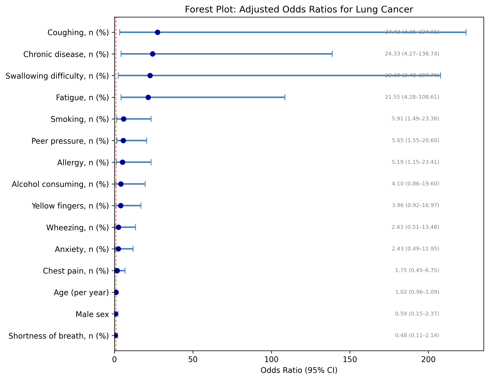
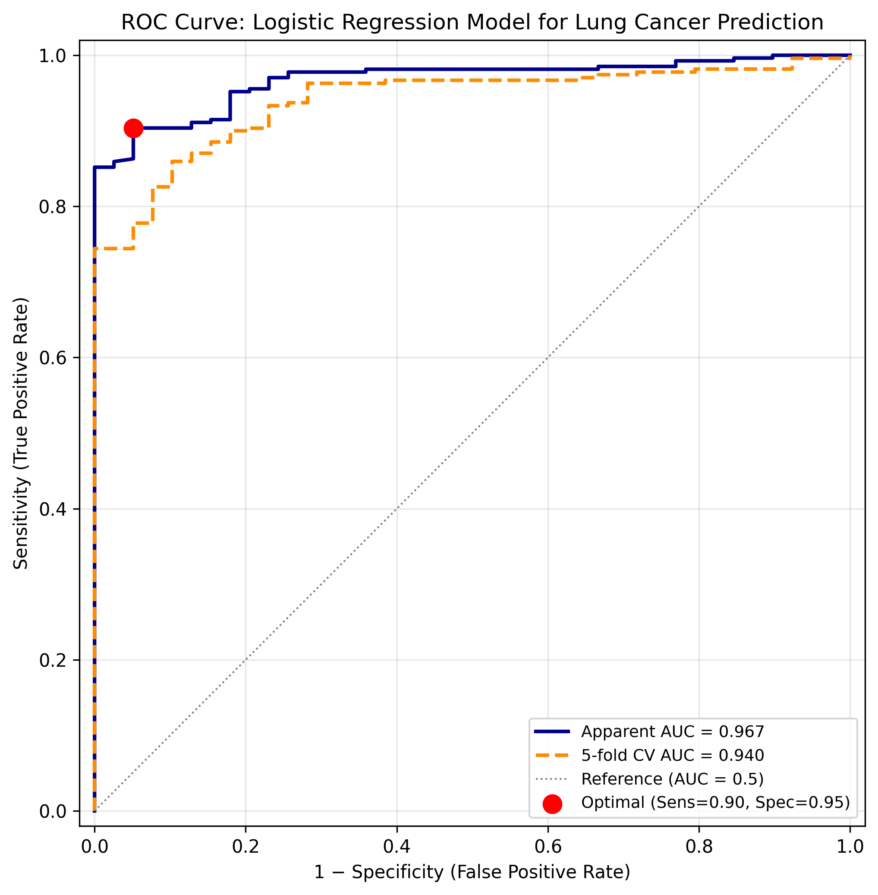

# Lung Cancer Survey Analysis Example

This example is a runnable medical statistics workflow for a lung cancer survey dataset. It uses `data/survey lung cancer.csv`, a Kaggle Lung Cancer Survey style CSV with 309 observations, 16 source variables, and `LUNG_CANCER` as the binary outcome.

The analysis demonstrates the core workflow expected from this repository's Python medical statistics skills:

- Load and clean a compact clinical survey dataset.
- Strip inconsistent column-name whitespace.
- Recode questionnaire values from `1 = no`, `2 = yes` into `0/1` indicators.
- Recode `LUNG_CANCER` into a binary outcome.
- Build Table 1 summaries stratified by outcome status.
- Run chi-square / Fisher exact tests for categorical predictors.
- Compare age between outcome groups with Welch t-test and Mann-Whitney U test.
- Fit a multivariable logistic regression model and export odds ratios with 95% confidence intervals.
- Estimate apparent and 5-fold cross-validated ROC AUC.
- Explore predictor correlation, PCA symptom patterns, subgroup odds ratios, calibration, risk deciles, symptom clustering, model comparison, and permutation importance.
- Export tables and figures for downstream reporting.

## Run

Install dependencies from the repository root:

```bash
python3 -m pip install -r requirements.txt
```

Run the script from the repository root:

```bash
python3 example/lung-cancer/analysis/lung_cancer_analysis.py
```

The script resolves paths relative to its own location, so it does not depend on a hard-coded checkout path.

## Outputs

Outputs are saved under `analysis/outputs/kaggle_survey/`:

- `tables/table1_descriptive.csv`
- `tables/chi_square_tests.csv`
- `tables/age_ttest_results.csv`
- `tables/logistic_regression_ORs.csv`
- `tables/logistic_model_fit.csv`
- `tables/roc_threshold_table.csv`
- `tables/auc_summary.csv`
- `tables/correlation_matrix.csv`
- `tables/pca_explained_variance.csv`
- `tables/pca_loadings.csv`
- `tables/subgroup_odds_ratios.csv`
- `tables/calibration_table.csv`
- `tables/risk_deciles.csv`
- `tables/model_comparison.csv`
- `tables/permutation_importance.csv`
- `figures/fig1_age_boxplot.png`
- `figures/fig2_forest_plot_OR.png`
- `figures/fig3_roc_curve.png`
- `figures/fig4_correlation_heatmap.png`
- `figures/fig5_pca_biplot.png`
- `figures/fig6_subgroup_forest.png`
- `figures/fig7_calibration_distribution.png`
- `figures/fig8_clustermap.png`
- `figures/fig9_permutation_importance.png`

The companion notebook `analysis/kaggle_lung_cancer_analysis.ipynb` includes a more exploratory version of the same case study and may generate additional figures.

## Example Results

The checked-in output snapshot reports:

- N = 309, with 270 `LUNG_CANCER = YES` and 39 `NO`.
- 5-fold cross-validated AUC = `0.9397`.
- Apparent logistic regression AUC = `0.9674`; random forest 5-fold cross-validated AUC = `0.9168`.
- The first two PCA components explain `32.0%` of predictor variance.
- The top random forest permutation-importance predictors are allergy, swallowing difficulty, peer pressure, alcohol consuming, and fatigue.
- Significant adjusted logistic regression predictors include smoking, peer pressure, chronic disease, fatigue, allergy, coughing, and swallowing difficulty.

Representative figures:





Additional generated figures are available after running the analysis:


## Data Note

The dataset follows the public Kaggle Lung Cancer Survey format. The notebook cites `https://www.kaggle.com/datasets/mysarahmadbhat/lung-cancer` as the source. Downstream users should check the source dataset page and license metadata before redistributing the data outside this example.
